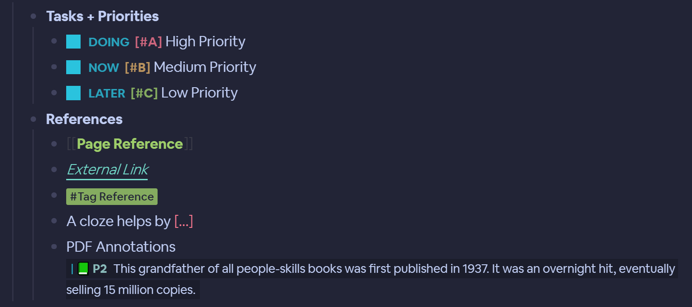
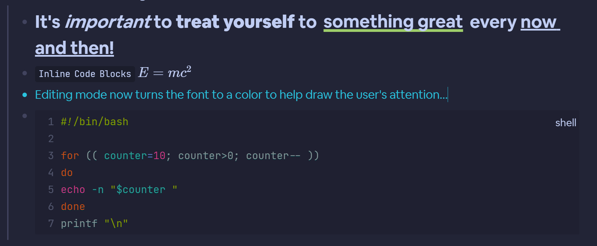
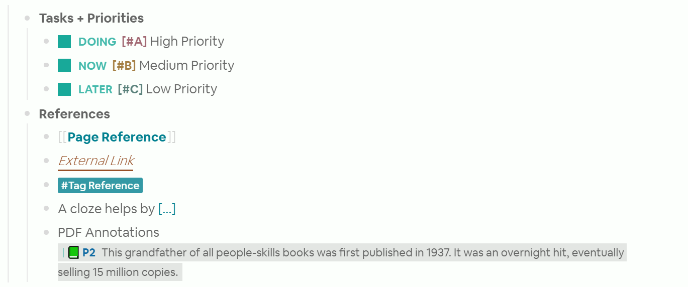
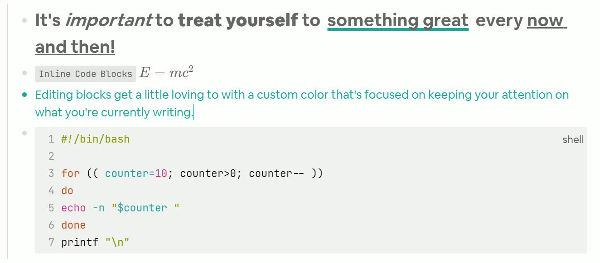
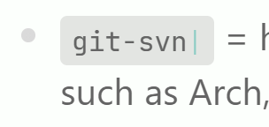
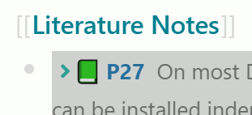

# Tokyo Night
Ported from Obsidian, all credits for the theme and its colors go to the original author [URL](https://github.com/RuslanGagushin/Tokyo-Night-Obsidian-Theme)... My focus was to make this theme module enough that you can adjust several aspects of the theme from inside your `custom.css` without breaking your other themes.

## Getting Started
- Clone this repo to your computer.
- Install the theme as a Plugin inside LS and you're set to go.

## Feedback
- Feedback is welcome! If you have suggestions feel free to submit a PR.

# Color Choices elements in Logseq
The choice of colors that went into the various elements of LS actually have some thought and reasoning behind them that came from [site](https://www.shiftelearning.com/blog/how-do-colors-influence-learning). 

The idea is to promote a visually appealing experience, while building an environment that's distraction free (flat style) with colors that promote capturing the user's attention and boosting mental productivity.

## Dark Theme


  

## Light Theme
  

  

# Settings
You can pick and choose what pieces you want from this section, drop it into your `custom.css` and modify the theme settings from there.

```css
.theme-settings,
html[data-theme=dark] {
    /* === FONTS === */
    --ts-monospace-font: "JetBrains Mono", "Fira Code", Monaco, Menlo, Consolas, 'COURIER NEW', monospace; /* Primarily for inline code and code blocks */
    --ts-serif-font: "Airbnb Cereal App", system-ui,-apple-system,'Segoe UI',Roboto,Helvetica,Arial,sans-serif,'Apple Color Emoji','Segoe UI Emoji'; /* Used for 90% of all blocks */
    /* === LS Features === */
    --ts-cloze-color: var(--cd-active-color-2);
    /* === SELECTIONS === */
    --ts-selected-bg-color: var(--cd-highlight-bg-color);
    /* === TAGS === */
    --ts-tag-color: var(--cd-primary-bg-color);
    --ts-tag-background-color: var(--cd-active-color-1);
    --ts-tag-weight: 500;
    --ts-tag-color-hover: var(--cd-primary-bg-color);
    --ts-tag-border-hover: 0px solid var(--ts-tag-color-hover);
    --ts-tag-border: 0px solid var(--cd-active-color-1);
    --ts-tag-border-radius: 2px;
    --ts-tag-padding: 0px 4px 0px 4px;
    --ts-tag-box-shadow: 0px 0px;
    --ts-tag-text-decoration: underline;
    --ts-tag-text-decoration-thickness: 2px;
    --ts-tag-text-decoration-color: var(--cd-active-color-1);
    /* === PAGE REFERENCES === */
    --ts-page-ref-color: var(--cd-active-color-1);
    --ts-page-ref-padding: 0px 1px 0px 1px;
    --ts-page-ref-border: 0px solid var(--ts-text-background);
    --ts-page-ref-border-radius: 0px;
    --ts-page-ref-background: transparent;
    --ts-page-ref-bracket-color: var(--cd-standby-color-1);
    /* === PROPERTIES === */
    --ts-property-background-color: var(--cd-secondary-bg-color);
    --ts-property-value-weight: 800;
    --ts-property-key-weight: 400;
    --ts-property-key-color: var(--cd-primary-text-color);
    --ts-property-border: 0px;
    --ts-property-border-radius: 0px;
    --ts-property-key-transform: lowercase;
    --ts-property-key-color: var(--cd-primary-text-color);
    --ts-property-value-color: var(--cd-primary-text-color);
    --ts-property-value-weight: 500;
    --ts-property-value-transform: uppercase;
    /* === TASKS === */
    --ts-checkbox-border: 0px solid var(--cd-standby-color-1);
    --ts-checkbox-border-radius: 0px;
    --ts-checkbox-background: var(--cd-standby-color-1);
    --ts-task-color: var(--cd-standby-color-1);
    --ts-task-opacity: 0.8;
    /* === PRIORITY ITEMS === */
    --ts-priority-a-color: var(--cd-active-color-2);
    --ts-priority-b-color: var(--cd-active-color-4);
    --ts-priority-c-color: var(--cd-active-color-1);
    /* === GUIDELINE === */
    --ts-guideline-inactive-color: var(--cd-inactive-color);
    --ts-guideline-active-color: var(--cd-active-color);
    /* === BULLET === */
    --ts-bullet-closed-color: rgba(53, 42, 42, 0.3);
    /* === EMBEDS === */
    --ts-embed-border: 0px;
    --ts-embed-border-radius: 0px;
    /* === MARKDOWN === */
    --ts-title-color: var(--cd-primary-text-color);
    --ts-text-bold-color: var(--cd-primary-text-color);
    --ts-text-italic-color: var(--cd-primary-text-color);
    --ts-editor-block-text-color: var(--cd-standby-color-1);
    --ts-underline-color: var(--cd-standby-color-1);
    --ts-strikethrough-color: var(--cd-primary-text-color);
    /* === HIGHLIGHTER === */
    --ts-headline-color: var(--cd-primary-text-color);
    --ts-highlight-color: var(--cd-primary-text-color);
    --ts-highlight-background-color: transparent;
    --ts-highlight-decoration-style: underline;
    --ts-highlight-decoration-color: var(--cd-active-color-1);
    --ts-highlight-underline-thickness: 4px;
    /* === CODE BLOCKS === */
    --ts-inline-code-bg: var(--cd-alternate-bg-color);
    --ts-inline-code-color: var(--cd-primary-text-color);
    /* === TABLES === */
    --ts-table-rows: var(--cd-highlight-bg-color);
    /* === EXT LINKS === */
    --ts-ext-link-color: var(--cd-active-color-5);
    --ts-ext-link-bg-color: transparent;
    --ts-ext-link-border-bottom: 2px solid var(--cd-active-color-5);
    --ts-ext-link-weight: 300;
    --ts-ext-link-style: italic;
    /* == COLORS == */
    --cd-primary-bg-color: #222436;
    --cd-secondary-bg-color: #1f2031;
    --cd-alternate-bg-color: #1b1d2b;
    --cd-quaternary-bg-color: #181926;
    --cd-highlight-bg-color: #31344E;
    --cd-inactive-color: #323347;
    --cd-active-color: #41435e;
    --cd-primary-text-color: #C0CDF3;
    --cd-alternate-text-color: #adb9db;
    --cd-active-color-1: #9ece6a;
    --cd-active-color-2: #f7768e;
    --cd-active-color-3: #ff9e64;
    --cd-active-color-4: #e0af68;
    --cd-active-color-5: #73daca;
    --cd-active-color-6: #2ac3de;
    --cd-active-color-7: #7dcfff;
    --cd-active-color-8: #7aa2f7;
    --cd-active-color-9: #bb9af7;
    --cd-active-color-10: ;
    --cd-active-color-11: ;
    --cd-standby-color-1: #2ac3de;
    /* Highlighter Plugin */
    --cd-mark-yellow: #e9c46a;
    --cd-mark-red: #DB3A34;
    --cd-mark-purple: #5941a9;
    --cd-mark-orange: #f17300;
    --cd-mark-grey: #94A89A;
    --cd-mark-green: #9cb380;
    --cd-mark-blue: #548687;
    --cd-mark-pink: #fab2ea;
}

.theme-settings,
html[data-theme=light] {
    /* === FONTS === */
    --ts-monospace-font: "JetBrains Mono", "Fira Code", Monaco, Menlo, Consolas, 'COURIER NEW', monospace; /* Primarily for inline code and code blocks */
    --ts-serif-font: "Airbnb Cereal App", system-ui,-apple-system,'Segoe UI',Roboto,Helvetica,Arial,sans-serif,'Apple Color Emoji','Segoe UI Emoji'; /* Used for 90% of all blocks */
    /* === LS Features === */
    --ts-cloze-color: var(--cd-active-color-1);
    /* === SELECTIONS === */
    --ts-selected-bg-color: var(--cd-highlight-bg-color);
    /* === TAGS === */
    --ts-tag-weight: 500;
    --ts-tag-color: var(--cd-primary-bg-color);
    --ts-tag-color-hover: var(--cd-primary-bg-color);
    --ts-tag-background-color: var(--cd-active-color-1);
    --ts-tag-border: 0px solid var(--cd-active-color-4);
    --ts-tag-border-radius: 2px;
    --ts-tag-border-hover: 0px solid var(--ts-tag-color-hover);
    --ts-tag-padding: 0px 4px 0px 4px;
    --ts-tag-box-shadow: 0px 0px;
    --ts-tag-text-decoration: none;
    --ts-tag-text-decoration-thickness: 0px;
    --ts-tag-text-decoration-color: var(--cd-active-color-4);
    --ts-tag-text-decoration-skip: none;
    /* === PAGE REFERENCES === */
    --ts-page-ref-color: var(--cd-active-color-1);
    --ts-page-ref-padding: 0px 1px 0px 1px;
    --ts-page-ref-border: 0px solid var(--ts-text-background);
    --ts-page-ref-border-radius: 0px;
    --ts-page-ref-background: transparent;
    --ts-page-ref-bracket-color: var(--cd-standby-color-1);
    /* === PROPERTIES === */
    --ts-property-background-color: var(--cd-secondary-bg-color);
    --ts-property-value-weight: 800;
    --ts-property-key-weight: 400;
    --ts-property-key-color: var(--cd-primary-text-color);
    --ts-property-border: 0px;
    --ts-property-border-radius: 0px;
    --ts-property-key-transform: lowercase;
    --ts-property-key-color: var(--cd-primary-text-color);
    --ts-property-value-color: var(--cd-primary-text-color);
    --ts-property-value-weight: 600;
    --ts-property-value-transform: uppercase;
    /* === TASKS === */
    --ts-checkbox-border: 0px solid var(--cd-standby-color-1);
    --ts-checkbox-border-radius: 0px;
    --ts-checkbox-background: var(--cd-standby-color-1);
    --ts-task-color: var(--cd-standby-color-1);
    --ts-task-opacity: 0.8;
    /* === PRIORITY ITEMS === */
    --ts-priority-a-color: var(--cd-active-color-4);
    --ts-priority-b-color: var(--cd-active-color-6);
    --ts-priority-c-color: var(--cd-active-color-8);
    /* === GUIDELINE === */
    --ts-guideline-inactive-color: var(--cd-inactive-color);
    --ts-guideline-active-color: var(--cd-active-color);
    /* === BULLET === */
    --ts-bullet-closed-color: rgba(53, 42, 42, 0.3);
    /* === EMBEDS === */
    --ts-embed-border: 0px;
    --ts-embed-border-radius: 0px;
    /* === MARKDOWN === */
    --ts-editor-block-text-color: var(--cd-standby-color-1);
    --ts-title-color: var(--cd-primary-text-color); /* PAGE TITLES */
    --ts-headline-color: var(--cd-primary-text-color); /* H1, H2, H3, H4, H5, H6 {HEADERS} */
    --ts-text-bold-color: var(--cd-primary-text-color);
    --ts-text-italic-color: var(--cd-primary-text-color);
    --ts-underline-color: var(--cd-standby-color-1);
    --ts-strikethrough-color: var(--cd-alternate-text-color);
    /* === HIGHLIGHTER === */
    --ts-highlight-decoration-style: underline;
    --ts-highlight-underline-thickness: 4px;
    --ts-highlight-color: var(--cd-primary-text-color);
    --ts-highlight-background-color: transparent;
    --ts-highlight-decoration-color: var(--cd-standby-color-1);
    /* === CODE BLOCKS === */
    --ts-inline-code-bg: var(--cd-alternate-bg-color);
    --ts-inline-code-color: var(--cd-primary-text-color);
    /* === TABLES === */
    --ts-table-rows: var(--cd-highlight-bg-color);
    /* === EXT LINKS === */
    --ts-ext-link-color: var(--cd-active-color-5);
    --ts-ext-link-bg-color: transparent;
    --ts-ext-link-border-bottom: 2px solid var(--cd-active-color-5);
    --ts-ext-link-weight: 300;
    --ts-ext-link-style: italic;
    /* == COLORS == */
    --cd-primary-bg-color: #FCFFFC;
    --cd-secondary-bg-color: #EFF2EF;
    --cd-alternate-bg-color: #E3E6E3;
    --cd-quaternary-bg-color: #D6D9D6;
    --cd-highlight-bg-color: #dddee2;
    --cd-inactive-color: #ececec;
    --cd-active-color: #dadada;
    --cd-primary-text-color: #646564;
    --cd-alternate-text-color: #313131;
    --cd-active-color-1: #028090;
    --cd-active-color-2: #565f89;
    --cd-active-color-3: #2e5077;
    --cd-active-color-4: #8c4351;
    --cd-active-color-5: #965027;
    --cd-active-color-6: #8f5e15;
    --cd-active-color-7: #83ac57;
    --cd-active-color-8: #33635c;
    --cd-active-color-9: #166775;
    --cd-active-color-10: #34548a;
    --cd-active-color-11: #5a4a78;
    --cd-standby-color-1: #18a999;
    --cd-mark-yellow: #e9c46a;
    --cd-mark-red: #DB3A34;
    --cd-mark-purple: #5941a9;
    --cd-mark-orange: #f17300;
    --cd-mark-grey: #94A89A;
    --cd-mark-green: #9cb380;
    --cd-mark-blue: #548687;
    --cd-mark-pink: #fab2ea;
}
```

## Snippets
These are optional snippets that you can add to your custom.css if you want the extra flashy stuff.

**inline code blinking cursor**  
  

```css
:not(pre)>code::after {
    font-family: "Font Awesome 5";
    font-weight: 900;
    font-size: 100%;
    content: "|";
    position: relative;
    top: -1px;
    color: var(--cd-standby-color-1);
    animation: pulse2 linear 1s infinite;
    margin-right: 2px;
    margin-left: 2px;
}
```

**right carrot arrow prefixed to block references**  
  

```css
.block-ref:before {
    content: "\f105";
    color: var(--cd-standby-color-1);
    font-size: 100%;
    padding-right: 0.2em;
}
```
