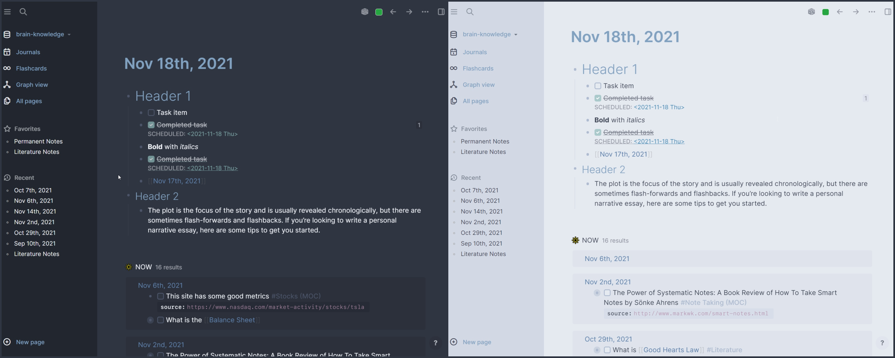

Tokyo Themes originally started out as a conversion of the Tokyo Night theme from VSCode, and since then has converted a number of popular themes found from other popular text editors to Logseq. To get started you'll want to install the theme from the Marketplace.

# Available Themes 
**Nord Theme**

## Feedback
Feedback is welcome! If you have suggestions feel free to submit a PR.
